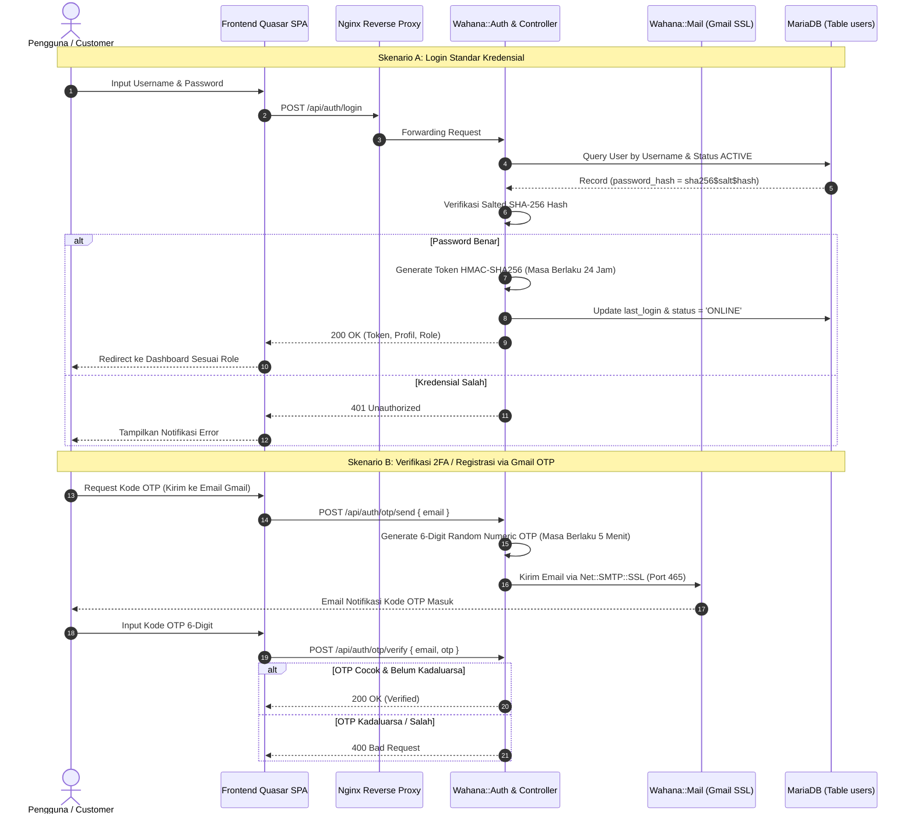
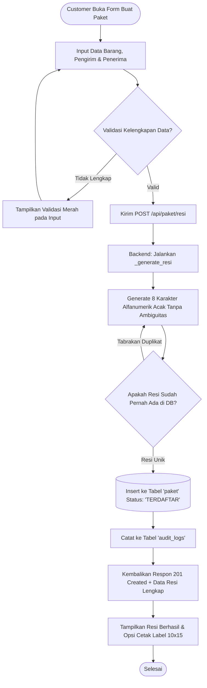
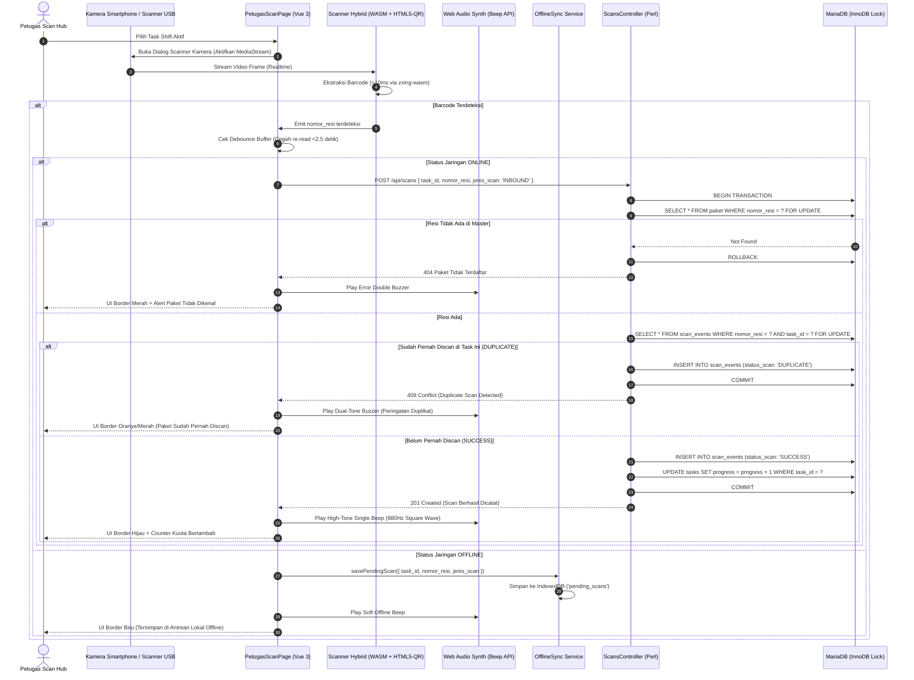

# 📋 PRODUCT REQUIREMENT DOCUMENT (PRD)
## Dijak Express (Scan-RESI) — Platform Manajemen Paket, Barcode Scanning Logistik & Ketahanan Offline Terintegrasi

---

### Informasi Dokumen & Kontrol Versi
* **Nama Produk**: Dijak Express (Scan-RESI Ecosystem)
* **Versi Dokumen**: v2.0.0 (Comprehensive Enterprise Edition)
* **Status Dokumen**: Approved & Production Ready
* **Target Rilis**: Q3 2026
* **Domain**: Logistik, Supply Chain, Hub Express Sorting, & Kurir Last-Mile
* **Klasifikasi Sistem**: Progressive Web App (PWA) + High-Performance Micro-Perl Engine + MariaDB Cluster

---

## 1. Ringkasan Eksekutif & Visi Produk (Executive Summary)

### 1.1 Latar Belakang Masalah
Dalam operasional industri logistik modern, kecepatan, akurasi pelacakan resi (*airway bill*), dan keandalan data pada titik pertukaran (*hub/sorting center*) merupakan faktor penentu kepuasan pelanggan dan efisiensi biaya. Tantangan utama yang dihadapi di lapangan mencakup:
1. **Titik Buta Jaringan (Dead Zones)**: Gudang, basement hub ekspedisi, dan area transit kerap mengalami koneksi internet yang tidak stabil atau terputus total. Sistem berbasis web konvensional akan lumpuh (*down*) dan menghentikan proses pemilahan (*sorting*).
2. **Kecepatan & Akurasi Pemindaian Barcode**: Pemindai kamera biasa sering lambat mendeteksi barcode rusak, terlipat, atau format khusus (seperti Code 93, UPC-E, atau GS1 DataBar).
3. **Risiko Resi Ganda (*Duplicate Scanning*)**: Tanpa kontrol konkurensi data yang ketat di level basis data, pemindaian resi berulang dapat mengacaukan perhitungan kompensasi petugas, salah rute, dan distorsi laporan manifest.
4. **Standardisasi Label**: Pencetakan resi pengirim sering kali tidak memenuhi standar ukuran thermal A6 (10x15 cm) yang diakui konveyor sortir otomatis industri.

### 1.2 Visi & Solusi Produk
**Dijak Express (Scan-RESI)** dirancang sebagai platform logistik *enterprise-grade* *end-to-end* yang memadukan keandalan **Progressive Web App (PWA)** dengan kapabilitas **Offline-First**, mesin pemindai barcode **Hybrid C++ WebAssembly (WASM)**, serta backend **Perl uWSGI** berlatensi sangat rendah.

Sistem ini mendigitalisasi siklus hidup paket logistik:
* **Customer**: Pendaftaran mandiri, pembuatan nomor resi acak server-side 8-karakter alfanumerik anti-tebak, dan pencetakan label thermal 10x15 cm berstandar ekspedisi.
* **Petugas Hub**: Pemindaian kilat multi-format (<10 ms/frame) menggunakan smartphone atau scanner barcode fisik, audio-visual feedback, serta **pencatatan antrean lokal (IndexedDB)** yang secara otomatis menyinkronkan data ketika internet pulih (*Zero Data Loss*).
* **Manajemen (Admin)**: Pemantauan KPI rayon harian, alokasi penugasan shift secara presisi, proteksi duplikasi transaksional (*pessimistic locking*), serta penelusuran jejak audit (*audit trail*).

---

## 2. Target Pengguna & Role-Based Access Control (RBAC)

Sistem menerapkan prinsip *Least Privilege* dengan pengamanan dua lapis:
1. **Client Guard**: Navigasi Vue Router 4 memblokir rute UI sebelum dirender.
2. **Server Guard**: Middleware `Wahana::Auth` memvalidasi signature token HMAC-SHA256 dan mencocokkan hak akses peran (*Role Enforcement*) di setiap panggilan endpoint REST API.

```text
+---------------------------------------------------------------------------------------------------+
|                                 HIERARKI PENGGUNA & HAK AKSES                                    |
+-------------------+----------------------------------------------------+--------------------------+
| Peran (Role)      | Tanggung Jawab Operasional                         | Lingkup Hak Akses        |
+-------------------+----------------------------------------------------+--------------------------+
| SUPERADMIN /      | Memelihara konfigurasi sistem, membuat pengguna,   | - Akses seluruh portal   |
| ADMIN             | mengalokasikan task/shift petugas, memantau KPI,   | - CRUD User & Role       |
|                   | meninjau anomali pemindaian, dan mengaudit log.    | - Alokasi Tugas & Shift  |
|                   |                                                    | - Pelaporan & Audit Trail|
+-------------------+----------------------------------------------------+--------------------------+
| PETUGAS_SCAN      | Personel lapangan pada hub / warehouse / sortir.    | - Akses Petugas Portal   |
| (Hub Operator)    | Menjalankan sesi scan Inbound & Outbound, memvalidasi| - Eksekusi Scan Kamera   |
|                   | fisik resi paket, dan menyinkronkan data offline.  | - Riwayat Scan Tugas     |
+-------------------+----------------------------------------------------+--------------------------+
| CUSTOMER          | Pelanggan / merchant pengirim barang. Melakukan    | - Akses Customer Portal  |
| (Sender/Merchant) | input pesanan paket mandiri, mencetak label resi   | - Input Pendaftaran Paket|
|                   | thermal, dan memantau status manifes paketnya.     | - Cetak Label Resi 10x15 |
|                   |                                                    | - Riwayat Paket Sendiri  |
+-------------------+----------------------------------------------------+--------------------------+
```

---

## 3. Proses Bisnis Terintegrasi (Business Process Workflows)

Berikut adalah 8 (delapan) alur proses bisnis inti yang mendasari operasional sistem Dijak Express.

### 3.1 Alur Bisnis 1: Autentikasi Pengguna, Registrasi Mandiri & Keamanan OTP


#### Aturan Bisnis (Business Rules):
1. **Password Hashing**: Tidak ada teks polos. Format hashing wajib mematuhi standar `sha256$<salt>$<hash>`.
2. **Brute-Force Shield**: `Wahana::RateLimit` membatasi percobaan akses login/OTP maksimal 100 request/menit per IP.
3. **Session Expiry**: Token sesi kedaluwarsa setelah 24 jam tanpa perpanjangan otomatis jika pengguna log out.

---

### 3.2 Alur Bisnis 2: Pendaftaran Paket & Pembuatan Resi Acak (Customer Lifecycle)


#### Aturan Bisnis (Business Rules):
1. **Karakter Resi Unik**: Algoritma nomor resi menghasilkan kombinasi 8 karakter alfanumerik kapital (*uppercase*) tanpa karakter ambigu yang sering membingungkan operator (mengecualikan karakter visual identik seperti angka `0` dan huruf `O`, angka `1` dan huruf `I`). Contoh nomor resi: `GJXL8FLB`, `D99X5MV2`.
2. **Inisialisasi Status**: Paket yang baru dibuat langsung memiliki status awal `TERDAFTAR`.
3. **Audit Trail Otomatis**: Setiap paket mencatat `created_by` (ID Customer) dan memicu penambahan record di `audit_logs`.

---

### 3.3 Alur Bisnis 3: Pencetakan Label Thermal Resi Standar Ekspedisi (10x15 cm)
1. **Trigger**: Customer atau Admin mengklik tombol "Cetak Label" pada daftar paket.
2. **Format Label Fisik**: Label dirancang dengan standar industri ukuran **A6 (10 cm x 15 cm / 4x6 inci)** yang kompatibel langsung dengan printer thermal (Xprinter, Zebra, dsb).
3. **Elemen Wajib pada Label**:
   * **Header**: Logo Dijak Express, tanggal booking, dan jenis layanan (`REGULER`, `EXPRESS`, atau `SAME_DAY`).
   * **Barcode 1D (Code 128)**: Dihasilkan menggunakan library `JsBarcode` / `bwip-js` dengan teks nomor resi di bawahnya. Menjadi target utama pemindaian barcode scanner konvensional maupun kamera.
   * **QR Code 2D**: Dihasilkan menggunakan library `qrcode` untuk memfasilitasi pemindaian cepat smartphone kurir di lapangan.
   * **Rute Asal - Tujuan**: Huruf kapital tebal (*bold*) menampilkan kota pengirim ke kota penerima beserta kode pos untuk kemudahan pemilahan manual (*manual sorting*).
   * **Detail Pengirim & Penerima**: Nama lengkap, nomor telepon (WhatsApp), dan alamat pengiriman terstruktur.
   * **Spesifikasi Fisik**: Berat paket (kg), jumlah koli, dan instruksi penanganan khusus jika ada.

---

### 3.4 Alur Bisnis 4: Alokasi Penugasan Shift & Target Kuota Hub (Admin Workflow)
1. **Trigger**: Admin membuka modul "Penugasan Petugas" (`/admin/tasks`).
2. **Penyusunan Tugas**:
   * Memilih tanggal operasional.
   * Menentukan shift: `Pagi` (08:00 - 16:00) atau `Sore` (16:00 - 00:00).
   * Menentukan lokasi operasional hub (contoh: `HUB CIPUTAT`, `HUB JAKSEL`).
   * Menetapkan target kuota pemindaian (misal: 100 paket per shift).
   * Menetapkan penugasan kepada pengguna dengan peran `PETUGAS_SCAN`.
3. **Status Task Lifecycle**:
   * `DRAFT`: Tugas baru dibuat oleh admin.
   * `PROSES_SCAN`: Tugas sedang dikerjakan secara aktif oleh petugas di lapangan.
   * `SELESAI`: Petugas atau admin menandai tugas telah selesai setelah kuota terpenuhi atau jam operasional shift berakhir.

---

### 3.5 Alur Bisnis 5: Pemindaian Resi Inbound & Outbound Hub (Petugas Scanning)


---

### 3.6 Alur Bisnis 6: Ketahanan Pemindaian Offline & Auto-Sync (Offline-First PWA)
```mermaid
stateDiagram-v2
    [*] --> OnlineMode: Terkoneksi Internet (Status: ONLINE)
    OnlineMode --> ScanOnline: Petugas Memindai Resi
    ScanOnline --> DirectAPI: Kirim HTTP POST Langsung ke Server
    DirectAPI --> OnlineMode

    OnlineMode --> NetworkDrop: Internet Terputus (Dead Spot Gudang)
    NetworkDrop --> OfflineMode: Navigator mendeteksi 'offline'

    OfflineMode --> ScanOffline: Petugas Tetap Memindai Resi Bebas Hambatan
    ScanOffline --> LocalQueue: Simpan Payload ke IndexedDB (pending_scans)
    LocalQueue --> OfflineFeedback: UI Beri Umpan Balik 'Tersimpan Offline'
    OfflineFeedback --> OfflineMode: Siap Memindai Resi Berikutnya

    OfflineMode --> NetworkRestore: Internet Kembali Pulih (Sinyal Terhubung)
    NetworkRestore --> BackgroundSync: Event 'online' memicu offlineSync.service.js
    BackgroundSync --> ReadQueue: Baca antrean pending_scans secara FIFO
    ReadQueue --> DispatchLoop: Kirim per batch ke POST /api/scans
    DispatchLoop --> RemoveQueue: Hapus item dari IndexedDB jika Server merespon 200/201/409
    RemoveQueue --> CheckEmpty{Masih Ada Antrean?}
    CheckEmpty -- Ya --> ReadQueue
    CheckEmpty -- Tidak --> SyncFinished: Seluruh Antrean Berhasil Disinkronkan
    SyncFinished --> OnlineMode: Tampilkan Notifikasi Banner Hijau 'Sync Sukses'
```

#### Aturan Bisnis (Business Rules):
1. **Zero Data Loss Guarantee**: Petugas tidak boleh terhenti bekerja hanya karena putusnya koneksi seluler/WiFi.
2. **FIFO Ingestion**: Antrean offline diunggah berdasarkan urutan waktu kejadian sebenarnya (*timestamp client*) saat pemindaian fisik dilakukan di lapangan.
3. **Idempotensi Duplikasi**: Jika sebuah resi yang ada di antrean offline ternyata sudah pernah masuk di server secara paralel, server secara elegan merespon kode duplikat tanpa menggagalkan pengiriman sisa antrean lainnya.

---

### 3.7 Alur Bisnis 7: Validasi Integritas Transaksional & Anti-Duplikasi Resi
1. **Masalah**: Resiko paket terhitung dua kali akibat jari operator gemetar menekan tombol scan berkali-kali, atau dua petugas memindai koli yang sama pada satu shift.
2. **Solusi Berlapis**:
   * **Lapisan Klien (Debounce & Cooldown Lock)**: Komponen scanner kamera memiliki buffer memori yang menolak pembacaan ulang resi yang sama dalam interval **2.500 milidetik (2,5 detik)**.
   * **Lapisan Server (Pessimistic Concurrency Lock)**:
     Backend mengeksekusi kueri `SELECT ... FOR UPDATE` pada baris resi di tabel `scan_events` dalam sebuah blok transaksi MariaDB ACID. Ini mengunci baris tersebut secara atomik sehingga mencegah *race condition* jika ada request paralel dari dua perangkat berbeda.
   * **Pembedaan Status Event**:
     Sistem tetap mencatat kejadian pemindaian ganda ke dalam tabel `scan_events` dengan nilai `status_scan = 'DUPLICATE'`, namun **TIDAK** menambah penghitung progres kuota pada tabel `tasks`.

---

### 3.8 Alur Bisnis 8: Monitoring Operasional, KPI Hub & Jejak Audit (Admin Portal)
1. **Executive Real-time Dashboard**:
   * Metrik utama: Total paket terdaftar harian, total scan sukses, rasio duplikasi (indikator anomali fisik), dan persentase penyelesaian target shift.
   * Pemantauan status personil: Jumlah petugas aktif berstatus `ONLINE` vs `OFFLINE`.
2. **Modul Audit Log**:
   * Setiap aktivitas kritis (Login, Scan Resi, Perubahan Master User, Perubahan Status Task) dicatat secara terpusat.
   * Atribut log audit: `log_id`, `user_id`, `action`, `details` (format JSON perubahan data), `ip_address`, dan `created_at`.
   * Akses audit log bersifat *Read-Only* bahkan bagi Superadmin guna menjaga integritas data forensik digital.

---

## 4. Spesifikasi Arsitektur Teknologi (Technology Stack & Implementation)

```text
+---------------------------------------------------------------------------------------------------+
|                                 ARSITEKTUR LENGKAP STACK TEKNOLOGI                               |
+---------------------------------------------------------------------------------------------------+
| CLIENT-SIDE TIER (Frontend SPA & PWA)                                                             |
|   - Base Framework          : Vue 3 (Composition API, `<script setup>`)                          |
|   - UI Component Suite      : Quasar Framework v2 (Material Design System)                       |
|   - Build Tool & Bundler    : Vite 5 (Fast HMR & Optimized Asset Chunking)                        |
|   - State Management Store  : Pinia v3 (authStore, packageStore, scanStore, taskStore)            |
|   - Offline Storage Engine  : Web Native IndexedDB API (Database: `WahanaScanOfflineDB`)          |
|   - PWA & Service Worker    : Google Workbox v7 (Pre-caching assets, runtime caching strategy)    |
|   - Barcode Scanner Hybrid  : zxing-wasm (WebAssembly C++) + html5-qrcode + @zxing/library        |
|   - Audio Feedback Engine   : Web Audio API (Native Oscillator Node - 880Hz Beep & Dual Buzzer)   |
|   - Barcode & QR Generator  : JsBarcode + bwip-js + node-qrcode                                   |
+---------------------------------------------------------------------------------------------------+
                                                  |
                                      (HTTPS / JSON REST API / 443)
                                                  v
+---------------------------------------------------------------------------------------------------+
| GATEWAY & REVERSE PROXY TIER (Nginx Alpine)                                                       |
|   - Static SPA Delivery     : Menyajikan compiled static assets (/dist/spa)                       |
|   - API Reverse Proxy       : Merutekan prefix `/api/*` ke Port 5000 (Perl uWSGI)                 |
|   - Interactive API Docs    : Swagger UI terpasang di `/api/docs` membaca `scanresi.yaml`        |
|   - Header Security         : X-Frame-Options, X-Content-Type-Options, Strict-Transport-Security |
+---------------------------------------------------------------------------------------------------+
                                                  |
                                       (HTTP Socket / Port 5000)
                                                  v
+---------------------------------------------------------------------------------------------------+
| APPLICATION SERVER TIER (Perl 5 uWSGI Engine)                                                     |
|   - Core Language           : Perl 5.36+ (High Speed, Minimal Footprint)                          |
|   - Application Server      : uWSGI PSGI Plugin (Preforking Master/Worker Model, Harakiri 60s)    |
|   - Routing Engine          : Wahana::Router (DCAF SWB Pattern dinamis membaca OpenAPI YAML)      |
|   - Rate Limiter Security   : Wahana::RateLimit (In-Memory Sliding Window, max 100 req/min/IP)    |
|   - Authentication Engine   : Wahana::Auth (HMAC-SHA256 Token Signature & Salted SHA-256 Hash)   |
|   - Transactional Query Cat : Wahana::Query (SQL Catalog terisolasi dengan DBI Placeholders)      |
|   - Notification Engine     : Wahana::Mail (Net::SMTP::SSL via Gmail Port 465 untuk OTP)          |
+---------------------------------------------------------------------------------------------------+
                                                  |
                                    (DBI:mysql / TCP Port 3306)
                                                  v
+---------------------------------------------------------------------------------------------------+
| PERSISTENCE DATABASE TIER (MariaDB 10.11+ / InnoDB Cluster)                                       |
|   - Database Engine         : MariaDB Enterprise Server (InnoDB Storage Engine)                   |
|   - Concurrency Control     : Pessimistic Row-Level Locking (`SELECT ... FOR UPDATE`)             |
|   - Data Integrity          : Foreign Key Constraints & Cascading References                      |
|   - Transaction Safety      : ACID Compliance (`eval { $dbh->begin_work; ... $dbh->commit; }`)   |
+---------------------------------------------------------------------------------------------------+
| CONTAINERIZATION & ORCHESTRATION TIER                                                             |
|   - Container Engine        : Docker Community Edition                                            |
|   - Multi-Container Compose : Docker Compose v2 (Services: db, backend, frontend, nginx)          |
|   - Internal Bridge Network : wahana_net (Terisolasi dari akses publik langsung)                  |
+---------------------------------------------------------------------------------------------------+
```

### 4.1 Spesifikasi Komponen Frontend (Vue 3 + Quasar PWA)
1. **Quasar Framework v2**:
   * Dipilih karena menyediakan komponen UI enterprise siap pakai yang responsif (desktop monitor sortir gudang, tablet konveyor, maupun smartphone Android kurir).
   * Mendukung mode PWA bawaan yang dapat di-*install* langsung ke layar utama (*Add to Home Screen*) perangkat petugas.
2. **Pinia Reactive Stores**:
   * `authStore`: Menyimpan status token, role, dan profil pengguna aktif.
   * `scanStore`: Mengelola status buffer pemindaian terkini, riwayat scan lokal, dan status konektivitas.
   * `packageStore`: Menampung cache master data paket dan rincian resi untuk validasi instan.
   * `taskStore`: Memantau progres ketercapaian kuota scan terhadap target shift.
3. **PWA & Offline Storage (IndexedDB Native)**:
   * Menggunakan modul `offlineDb.js` untuk membuka koneksi ke browser database `WahanaScanOfflineDB`.
   * Memiliki 3 Object Store:
     * `pending_scans`: Menyimpan data payload scan saat offline (KeyPath: `local_id`, AutoIncrement).
     * `cached_paket`: Menyimpan data paket terdaftar untuk validasi lokal saat offline (KeyPath: `nomor_resi`).
     * `cached_tasks`: Menyimpan daftar penugasan aktif petugas (KeyPath: `task_id`).

### 4.2 Spesifikasi Mesin Pemindai Barcode (Hybrid Scanner Engine)
1. **Arsitektur Pemindai Dua Mesin (Dual-Engine Hybrid)**:
   * **Engine Primer**: `zxing-wasm` (ZXing-C++ yang dikompilasi ke WebAssembly). Mesin ini memproses array piksel `ImageData` berkecepatan tinggi dengan waktu dekode **kurang dari 10 milidetik per frame**. Sangat unggul membaca format sulit seperti **Code 93, UPC-E, RSS-14 / GS1 DataBar, dan Aztec**.
   * **Engine Sekunder**: `html5-qrcode` & `@zxing/library` untuk manajemen stream webcam/kamera smartphone, resolusi dinamis, dan fallback pembacaan format 1D standar (Code 128, EAN-13).
2. **Kontrol Perangkat Keras Kamera**:
   * Deteksi kapabilitas lampu senter (*torch/flash*) perangkat menggunakan `MediaTrackCapabilities.torch`.
   * Tombol ganti kamera (*flip camera*) antara kamera belakang (*environment*) dan kamera depan (*user*).
3. **Sintesis Audio Bebas Aset (Web Audio API)**:
   * Mengeliminasi ketergantungan pada file file `.mp3` atau `.wav` eksternal yang rentan gagal dimuat.
   * Menggunakan instans native `window.AudioContext` dengan `OscillatorNode`:
     * **Scan Sukses**: Frekuensi 880 Hz (*A5 note*), tipe gelombang `square`, durasi 100 ms.
     * **Scan Duplikat / Peringatan**: Nada ganda rendah frekuensi 440 Hz turun ke 220 Hz, tipe gelombang `sawtooth`.

### 4.3 Spesifikasi Mesin Backend (Perl uWSGI + DCAF Router)
1. **Perl uWSGI Application Server**:
   * Memberikan *throughput* luar biasa dengan jejak memori (*RAM footprint*) yang sangat kecil (<50MB per worker).
   * Konfigurasi `backend/uwsgi.ini` mengaktifkan 4 worker proses dan 2 thread dengan *harakiri timeout* 60 detik untuk mencegah proses menggantung.
2. **Pola Dynamic Router DCAF (Data-Centric Application Framework)**:
   * Seluruh routing API tidak ditulis secara *hardcoded* pada kode Perl, melainkan dikendalikan secara dinamis oleh dokumen spesifikasi OpenAPI 3.0 (`backend/etc/api/scanresi.yaml`).
   * Rute diekstrak secara otomatis dari atribut `operationId: <method>/<ControllerName>`.
   * **Hot-Reloading mtime**: `Wahana::Router` mengecek waktu modifikasi file YAML secara berkala. Jika ada endpoint baru, router memperbarui rutenya secara instan tanpa perlu restart service uWSGI.
3. **Katalog Kueri SQL Terisolasi (`Wahana::Query`)**:
   * Menghilangkan kerentanan SQL Injection dengan memisahkan seluruh kueri ke berkas `backend/db/query.sql`.
   * Seluruh parameter dieksekusi secara ketat menggunakan DBI Prepared Statements dengan placeholder tanda tanya (`?`).
4. **Layanan Pengiriman Email OTP (`Wahana::Mail`)**:
   * Menggunakan modul Perl `Net::SMTP::SSL` untuk terhubung langsung ke server SMTP Google (`smtp.gmail.com:465`).
   * Mendukung template pesan email HTML responsif yang elegan untuk pengiriman kode verifikasi 6-digit.

### 4.4 Spesifikasi Basis Data & Konkurensi Transaksional (MariaDB)
1. **InnoDB Storage Engine**:
   * Mendukung penuh ACID (*Atomicity, Consistency, Isolation, Durability*).
2. **Pessimistic Concurrency Control**:
   * Mencegah *race condition* saat ribuan scan terjadi serempak dengan klausa `SELECT ... FOR UPDATE` sebelum operasi penulisan dilakukan.
3. **Foreign Key Integrity**:
   * Menjamin seluruh `scan_events` dan `tasks` selalu mereferensi entitas `users` dan `paket` yang valid di sistem.

---

## 5. Kebutuhan Fungsional (Detailed Functional Requirements)

### FR-01: Modul Keamanan & Manajemen Identitas (Authentication & IAM)
* **FR-01.1**: Sistem harus menyediakan form login standar berbasis `username` dan `password`.
* **FR-01.2**: Sistem harus melakukan verifikasi password terhadap hash `sha256$<salt>$<hash>`.
* **FR-01.3**: Sistem harus menghasilkan token sesi bertanda tangan HMAC-SHA256 yang memiliki masa kedaluwarsa 24 jam.
* **FR-01.4**: Sistem harus menyediakan fitur verifikasi dua faktor (2FA) dan pendaftaran akun via kode OTP 6-digit yang dikirimkan ke email Gmail pengguna melalui koneksi SSL.
* **FR-01.5**: Kode OTP harus kedaluwarsa dalam batas waktu 5 (lima) menit sejak dikirimkan.
* **FR-01.6**: Sistem harus menyediakan simulator *Quick Login* 1-klik untuk kemudahan pengujian di lingkungan development/demo antar ketiga role.
* **FR-01.7**: Sistem harus memperbarui status pengguna menjadi `ONLINE` saat login dan `OFFLINE` saat logout.

### FR-02: Modul Customer Portal & Registrasi Paket
* **FR-02.1**: Pengguna dengan peran `CUSTOMER` dapat menginput formulir pengiriman paket: detail barang, nama/telepon/alamat pengirim, dan nama/telepon/alamat penerima.
* **FR-02.2**: Backend harus membangkitkan nomor resi acak server-side 8-karakter alfanumerik kapital unik tanpa karakter ambigu (`_generate_resi`).
* **FR-02.3**: Sistem harus menyimpan data paket ke tabel `paket` dengan status default `TERDAFTAR`.
* **FR-02.4**: Customer dapat meninjau daftar riwayat paket miliknya sendiri dan menyaring berdasarkan tanggal atau nomor resi.

### FR-03: Modul Labeling & Cetak Resi Thermal
* **FR-03.1**: Sistem harus dapat merender label pengiriman berukuran standar industri **10 cm x 15 cm**.
* **FR-03.2**: Label harus memuat visual Barcode 1D (Code 128) dan QR Code 2D yang merepresentasikan nomor resi paket.
* **FR-03.3**: Label harus memformat nama kota asal dan kota tujuan pengiriman secara jelas untuk memudahkan penyortiran visual di konveyor logistik.
* **FR-03.4**: Sistem harus menyediakan tombol aksi cetak langsung yang memicu dialog cetak browser (*browser print dialog*) yang sudah teroptimasi dengan *CSS media print*.

### FR-04: Modul Alokasi Penugasan & Shift Operasional Hub
* **FR-04.1**: Administrator dapat membuat penugasan shift baru (`tasks`) yang berisi tanggal kerja, shift (Pagi/Sore), target kuota pemindaian, lokasi hub, dan ID petugas yang ditunjuk.
* **FR-04.2**: Petugas scan dapat melihat daftar tugas aktif yang dialokasikan kepada dirinya sendiri.
* **FR-04.3**: Sistem harus mengunci sesi pemindaian petugas ke satu task ID aktif yang dipilih.
* **FR-04.4**: Administrator atau petugas dapat menandai task sebagai `SELESAI` jika shift kerja telah rampung.

### FR-05: Modul Pemindaian Barcode & Scanner Kamera
* **FR-05.1**: Sistem harus menyediakan antarmuka pemindaian kamera interaktif yang memanfaatkan WebRTC `getUserMedia`.
* **FR-05.2**: Sistem harus mendukung pemindaian multi-format meliputi Code 128, QR Code, Code 93, UPC-A, UPC-E, EAN-13, EAN-8, Codabar, ITF, Data Matrix, PDF417, dan RSS-14 / GS1 DataBar.
* **FR-05.3**: Sistem harus menyediakan tombol pengendali lampu senter (*torch*) jika kamera fisik perangkat keras mendukungnya.
* **FR-05.4**: Sistem harus menyediakan tombol penggantian kamera (Depan/Belakang).
* **FR-05.5**: Komponen scanner harus menerapkan mekanisme *cooldown debounce* selama minimal 2.500 ms untuk mencegah pembacaan berulang pada paket fisik yang sama secara tidak sengaja.
* **FR-05.6**: Sistem harus mendukung input dari barcode scanner fisik berbasis USB/Bluetooth HID melalui text field barcode dengan pemicu otomatis tombol enter.

### FR-06: Modul Ketahanan Offline & Auto-Synchronization (Offline PWA)
* **FR-06.1**: Saat koneksi internet terputus (`navigator.onLine === false`), seluruh hasil pemindaian harus disimpan secara lokal di browser menggunakan database **IndexedDB** (`WahanaScanOfflineDB`, store `pending_scans`).
* **FR-06.2**: Sistem harus memvalidasi nomor resi lokal terhadap snapshot `cached_paket` yang tersimpan di IndexedDB saat kondisi offline.
* **FR-06.3**: Sistem harus menampilkan indikator visual status jaringan (*Online / Offline Badge*) dan jumlah antrean yang belum terkirim.
* **FR-06.4**: Ketika koneksi internet pulih, worker latar belakang (`offlineSync.service.js`) harus secara otomatis mendeteksi pemulihan sinyal dan mengunggah antrean scan secara FIFO ke endpoint `/api/scans`.
* **FR-06.5**: Item antrean di IndexedDB harus dihapus setelah mendapatkan konfirmasi respons keberhasilan dari backend server.
* **FR-06.6**: Sistem harus menyediakan tombol "Sinkronkan Manual" bagi petugas untuk memicu pengiriman paksa antrean offline.

### FR-07: Modul Validasi Transaksional & Anti-Duplikasi Resi
* **FR-07.1**: Backend harus memvalidasi bahwa nomor resi yang discan terdaftar di dalam database tabel `paket`.
* **FR-07.2**: Backend harus mengecek apakah nomor resi tersebut sudah pernah discan sebelumnya dalam task shift yang bersangkutan.
* **FR-07.3**: Jika nomor resi terdeteksi duplikat, backend harus menyimpan event scan dengan `status_scan = 'DUPLICATE'`, mengembalikan kode status HTTP 409 Conflict, dan **TIDAK** menambah penghitung kuota `progress` task.
* **FR-07.4**: Klien harus memutar efek audio *buzzer* nada ganda dan menampilkan animasi border merah jika terjadi respon `DUPLICATE`.
* **FR-07.5**: Jika nomor resi valid dan belum pernah discan, backend mencatat event dengan `status_scan = 'SUCCESS'`, menambah progres kuota task, memutar nada audio frekuensi tinggi 880 Hz, dan menampilkan animasi border hijau.

### FR-08: Modul Admin Monitoring, Pelaporan & Audit Trail
* **FR-08.1**: Dashboard admin harus menampilkan ringkasan metrik statistik: Total Paket, Total Scan Sukses, Total Scan Duplikat, dan Ketercapaian Kuota Shift.
* **FR-08.2**: Administrator dapat mengelola data pengguna (CRUD): membuat akun baru, mengubah nama/role, mereset password, dan menonaktifkan akun (`DISABLED`).
* **FR-08.3**: Sistem harus mencatat jejak audit pada tabel `audit_logs` untuk setiap aktivitas signifikan (Login, Scan Resi, Update User, Update Task).
* **FR-08.4**: Administrator dapat meninjau riwayat audit log lengkap dengan informasi User ID, jenis aksi, detail aksi, alamat IP asal, dan stempel waktu.
* **FR-08.5**: Sistem menyediakan fitur ekspor dan visualisasi laporan operasional harian berdasarkan shift dan petugas.

---

## 6. Kebutuhan Non-Fungsional (Non-Functional Requirements)

* **NFR-01 (Performa & Latensi)**:
  * Waktu dekode pemindaian kamera menggunakan engine WebAssembly C++ harus di bawah 15 ms per frame pada perangkat modern.
  * Waktu respon endpoint pemindaian online (`POST /api/scans`) harus di bawah 150 ms pada beban jaringan normal.
* **NFR-02 (Keandalan & Ketahanan Offline)**:
  * Sistem PWA harus tetap dapat digunakan secara normal untuk pemindaian resi meskipun koneksi internet terputus 100%.
  * Antrean IndexedDB harus mampu menampung hingga 10.000 record pemindaian lokal tanpa mengalami penurunan performa browser.
* **NFR-03 (Keamanan Data)**:
  * Seluruh komunikasi client-server diwajibkan menggunakan enkripsi HTTPS / TLS 1.3 pada lingkungan produksi.
  * Penyimpanan kata sandi wajib menggunakan salted SHA-256 hash.
  * Database query dilindungi dari serangan SQL Injection melalui DBI placeholder abstraction.
  * Endpoint publik dilindungi oleh rate limiting berbasis token bucket (maksimal 100 request/menit).
* **NFR-04 (Kompatibilitas Antarmuka & Perangkat Keras)**:
  * Aplikasi web PWA harus dapat berjalan lancar di browser Google Chrome (versi 90+), Mozilla Firefox, Microsoft Edge, Safari iOS (WebRTC Camera), dan Android Webview PWA.
  * Kompatibel dengan kamera smartphone resolusi standar (720p / 1080p) serta USB/Bluetooth Barcode Scanner Gun.
* **NFR-05 (Skalabilitas & Kontainerisasi)**:
  * Seluruh arsitektur harus dapat dijalankan secara terisolasi menggunakan Docker Compose multi-container.
  * Database MariaDB mendukung hingga 1.000 transaksi pemindaian konkuren per detik menggunakan InnoDB row-level locking.

---

## 7. Skema Basis Data & Spesifikasi Tabel (Database Schema)

Berikut adalah definisi struktur data fisik MariaDB 10.11+ yang digunakan oleh backend sistem:

```sql
-- 1. Master Pengguna Sistem & RBAC
CREATE TABLE users (
    id            VARCHAR(32)  NOT NULL,
    name          VARCHAR(100) NOT NULL,
    username      VARCHAR(50)  NOT NULL UNIQUE,
    password_hash VARCHAR(255) NOT NULL,
    role          ENUM('ADMIN','PETUGAS_SCAN','CUSTOMER') NOT NULL,
    status        ENUM('ONLINE','OFFLINE','DISABLED') NOT NULL DEFAULT 'OFFLINE',
    last_login    DATETIME     NULL,
    created_at    TIMESTAMP    NOT NULL DEFAULT CURRENT_TIMESTAMP,
    PRIMARY KEY (id)
) ENGINE=InnoDB DEFAULT CHARSET=utf8mb4;

-- 2. Master Alokasi Tugas & Shift Petugas Hub
CREATE TABLE tasks (
    task_id    VARCHAR(32)  NOT NULL,
    user_id    VARCHAR(32)  NOT NULL,
    shift      ENUM('Pagi','Sore') NOT NULL DEFAULT 'Pagi',
    tanggal    DATE         NOT NULL,
    target     INT          NOT NULL DEFAULT 100,
    progress   INT          NOT NULL DEFAULT 0,
    status     ENUM('DRAFT','PROSES_SCAN','SELESAI') NOT NULL DEFAULT 'DRAFT',
    lokasi     VARCHAR(100) NOT NULL DEFAULT 'CIPUTAT',
    created_at TIMESTAMP    NOT NULL DEFAULT CURRENT_TIMESTAMP,
    PRIMARY KEY (task_id),
    CONSTRAINT fk_tasks_user FOREIGN KEY (user_id) REFERENCES users (id) ON DELETE CASCADE
) ENGINE=InnoDB DEFAULT CHARSET=utf8mb4;

-- 3. Master Paket & Nomor Resi
CREATE TABLE paket (
    nomor_resi       VARCHAR(16)   NOT NULL,
    nama_barang      VARCHAR(150)  NULL,
    pengirim         VARCHAR(100)  NULL,
    alamat_pengirim  VARCHAR(255)  NULL,
    pengirim_detail  TEXT          NULL,
    telepon_pengirim VARCHAR(30)   NULL,
    penerima         VARCHAR(100)  NULL,
    alamat_tujuan    VARCHAR(255)  NULL,
    penerima_detail  TEXT          NULL,
    telepon_penerima VARCHAR(30)   NULL,
    berat_kg         DECIMAL(6,2)  NOT NULL DEFAULT 0,
    jenis_layanan    ENUM('REGULER','EXPRESS','SAME_DAY') NOT NULL DEFAULT 'REGULER',
    status           ENUM('DRAFT','TERDAFTAR') NOT NULL DEFAULT 'TERDAFTAR',
    created_by       VARCHAR(32)   NULL,
    created_at       TIMESTAMP     NOT NULL DEFAULT CURRENT_TIMESTAMP,
    PRIMARY KEY (nomor_resi),
    CONSTRAINT fk_paket_user FOREIGN KEY (created_by) REFERENCES users (id) ON DELETE SET NULL
) ENGINE=InnoDB DEFAULT CHARSET=utf8mb4;

-- 4. Transaksi Riwayat Pemindaian Resi Barcode (Inbound/Outbound)
CREATE TABLE scan_events (
    scan_id     VARCHAR(32)  NOT NULL,
    nomor_resi  VARCHAR(64)  NOT NULL,
    user_id     VARCHAR(32)  NOT NULL,
    task_id     VARCHAR(32)  NOT NULL,
    waktu_scan  DATETIME     NOT NULL DEFAULT CURRENT_TIMESTAMP,
    lokasi      VARCHAR(100) NOT NULL DEFAULT 'CIPUTAT',
    status_scan ENUM('SUCCESS','DUPLICATE') NOT NULL DEFAULT 'SUCCESS',
    device_id   VARCHAR(50)  NOT NULL DEFAULT 'SCAN-DEVICE-01',
    jenis_scan  ENUM('INBOUND','OUTBOUND') NOT NULL DEFAULT 'INBOUND',
    created_at  TIMESTAMP    NOT NULL DEFAULT CURRENT_TIMESTAMP,
    PRIMARY KEY (scan_id),
    KEY idx_scan_resi_task (nomor_resi, task_id),
    CONSTRAINT fk_scans_user FOREIGN KEY (user_id) REFERENCES users (id) ON DELETE CASCADE,
    CONSTRAINT fk_scans_task FOREIGN KEY (task_id) REFERENCES tasks (task_id) ON DELETE CASCADE,
    CONSTRAINT fk_scans_resi FOREIGN KEY (nomor_resi) REFERENCES paket (nomor_resi) ON DELETE CASCADE
) ENGINE=InnoDB DEFAULT CHARSET=utf8mb4;

-- 5. Rekam Jejak Audit Sistem (Audit Trail)
CREATE TABLE audit_logs (
    log_id     BIGINT       NOT NULL AUTO_INCREMENT,
    user_id    VARCHAR(32)  NULL,
    action     VARCHAR(100) NOT NULL,
    details    TEXT         NULL,
    ip_address VARCHAR(45)  NULL,
    created_at TIMESTAMP    NOT NULL DEFAULT CURRENT_TIMESTAMP,
    PRIMARY KEY (log_id),
    CONSTRAINT fk_audit_user FOREIGN KEY (user_id) REFERENCES users (id) ON DELETE SET NULL
) ENGINE=InnoDB DEFAULT CHARSET=utf8mb4;
```

---

## 8. Kontrak Spesifikasi REST API (OpenAPI 3.0 Integration)

Seluruh payload request dan response ditransmisikan dalam format `application/json`. Endpoint terproteksi mewajibkan header HTTP: `Authorization: Bearer <token_hmac_sha256>`.

```text
+--------+----------------------------+-----------------------+-------------------------------------------------------------+
| Method | Endpoint                   | Hak Akses (Role)      | Deskripsi Fungsi Bisnis                                     |
+--------+----------------------------+-----------------------+-------------------------------------------------------------+
| GET    | /api/docs                  | Publik                | Halaman interaktif Swagger UI dokumentasi API               |
| GET    | /api/openapi.yaml          | Publik                | Dokumen sumber kontrak spesifikasi OpenAPI 3.0              |
+--------+----------------------------+-----------------------+-------------------------------------------------------------+
| POST   | /api/auth/login            | Publik                | Login standar kredensial username & password                |
| POST   | /api/auth/quick-login      | Publik (Demo)         | 1-Click quick login untuk simulasi role di environment demo |
| POST   | /api/auth/otp/send         | Publik                | Generate & kirim 6-digit OTP ke Gmail via SMTP SSL          |
| POST   | /api/auth/otp/verify       | Publik                | Verifikasi kode OTP 6-digit                                 |
| POST   | /api/auth/forgot-password  | Publik                | Permintaan lupa kata sandi & pengiriman token OTP reset     |
| POST   | /api/auth/reset-password   | Publik                | Eksekusi penggantian kata sandi dengan token terverifikasi  |
| POST   | /api/auth/logout           | Terotentikasi         | Mengakhiri sesi pengguna & update status OFFLINE            |
+--------+----------------------------+-----------------------+-------------------------------------------------------------+
| GET    | /api/users                 | Terotentikasi         | Mengambil daftar seluruh user sistem                        |
| POST   | /api/users                 | ADMIN                 | Membuat akun pengguna baru                                  |
| PUT    | /api/users/:id             | ADMIN                 | Memperbarui data pengguna & peran                           |
| DELETE | /api/users/:id             | ADMIN                 | Menghapus akun pengguna dari sistem                         |
| PATCH  | /api/users/:id/toggle      | ADMIN                 | Mengubah status akun (ONLINE, OFFLINE, DISABLED)            |
+--------+----------------------------+-----------------------+-------------------------------------------------------------+
| GET    | /api/tasks                 | Terotentikasi         | Mengambil daftar task shift operasional                     |
| POST   | /api/tasks                 | ADMIN                 | Membuat dan mengalokasikan task shift baru ke petugas        |
| PATCH  | /api/tasks/:id/progress    | Terotentikasi         | Memperbarui penghitung progres pemindaian task              |
| PATCH  | /api/tasks/:id/complete    | Terotentikasi         | Menandai status task telah rampung (SELESAI)                |
+--------+----------------------------+-----------------------+-------------------------------------------------------------+
| POST   | /api/paket/resi            | CUSTOMER, ADMIN       | Generate resi acak 8-karakter & simpan paket baru           |
| GET    | /api/paket                 | Terotentikasi         | Mengambil daftar paket (Sesuai kepemilikan/role)            |
| GET    | /api/paket/:resi           | Terotentikasi         | Mengambil rincian spesifik satu nomor resi                  |
| PUT    | /api/paket/:resi           | CUSTOMER, ADMIN       | Memperbarui informasi paket sebelum disortir                |
+--------+----------------------------+-----------------------+-------------------------------------------------------------+
| POST   | /api/scans                 | PETUGAS_SCAN, ADMIN   | Eksekusi pemindaian resi (Validasi, Duplikasi, Concurrency) |
| GET    | /api/scans                 | Terotentikasi         | Mengambil histori event pemindaian                          |
| GET    | /api/scans/stats/:user_id  | Terotentikasi         | Rekapitulasi statistik performa pemindaian petugas          |
+--------+----------------------------+-----------------------+-------------------------------------------------------------+
| GET    | /api/audit-logs            | ADMIN                 | Membaca riwayat jejak audit aktivitas sistem                |
+--------+----------------------------+-----------------------+-------------------------------------------------------------+
```

---

## 9. Penjaminan Kualitas (QA) & Pengujian Otomatis

Platform Dijak Express dilengkapi suite pengujian otomatis menyeluruh:
1. **Automated E2E Full QA Matrix Test Suite (`tests/e2e_full_qa_matrix.py`)**:
   * Menjalankan 18 skenario uji fungsional, mencakup validasi payload login, generate resi acak, proteksi SQL Injection, throttling rate limit, pengujian transaksional `SELECT ... FOR UPDATE`, serta simulasi sinkronisasi antrean IndexedDB offline.
   * Menghasilkan laporan interaktif berformat HTML (`tests/laporan_qa.html`) dan dokumen PDF formal (`Laporan_QA_Menyeluruh_Scan_RESI.pdf`).
2. **Benchmark Kinerja Pemindai Barcode (`tests/benchmark_barcode_performance.js`)**:
   * Menguji kecepatan dekode 14 format barcode berbeda.
   * Hasil pengujian menunjukkan rata-rata kecepatan dekode WASM C++ adalah **4.8 ms per pembacaan**.
3. **Penyelarasan Standar Respon HTTP**:
   * Seluruh API mengembalikan struktur standar:
     ```json
     {
       "status": "success",
       "message": "Data resi berhasil dipindai",
       "data": { ... }
     }
     ```
     Atau jika terjadi error:
     ```json
     {
       "status": "error",
       "message": "Nomor resi sudah pernah discan pada sesi shift ini (DUPLICATE)",
       "error_code": "DUPLICATE_SCAN"
     }
     ```

---

## 10. Panduan Deployment & Manajemen Lingkungan (DevOps)

### 10.1 Topologi Docker Compose
Sistem berjalan dalam 4 container mandiri yang saling terhubung melalui bridge network internal:
* `wahana_scan_db`: Container MariaDB 10.11 melayani port `3306` (dipetakan ke port `3308` host untuk keperluan inspeksi).
* `wahana_scan_backend`: Container Perl uWSGI yang mengeksekusi service REST API pada port `5000`.
* `wahana_scan_frontend`: Container Quasar SPA / PWA yang menyajikan antarmuka visual pada port `9000`.
* `wahana_scan_nginx`: Reverse proxy gateway publik yang menerima koneksi HTTP pada port `8080`.

### 10.2 Perintah Orkestrasi
```bash
# 1. Menjalankan seluruh sistem secara terpadu di background:
./docker-up.sh

# 2. Memeriksa status kesehatan container:
docker-compose ps

# 3. Memantau log backend uWSGI realtime:
docker logs -f wahana_scan_backend

# 4. Menghentikan seluruh container secara aman:
./docker-down.sh
```

---

## 11. Kesimpulan & Milestone Implementasi

Dokumen PRD ini menjadi cetak biru (*blueprint*) dan acuan resmi bagi arsitektur perangkat lunak, tim engineering, staf operasional hub, dan manajemen **Dijak Express**. Melalui penggabungan teknologi PWA berketahanan offline, mesin decoding WebAssembly berkecepatan tinggi, serta backend Perl uWSGI yang tangguh, sistem ini menghadirkan efisiensi operasional sorting hub yang maksimal dan menjamin keandalan data logistik tanpa risiko kehilangan data.
